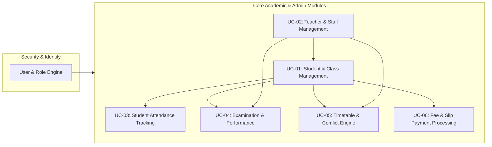
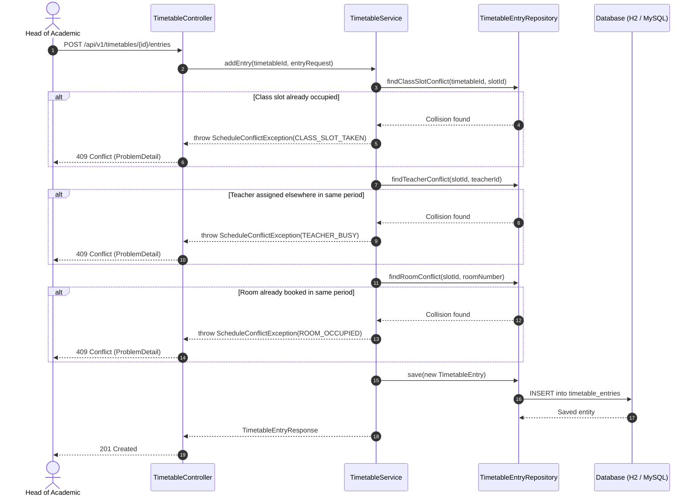

# Web-based School Information Management System (SIMS)

**Institution**: Sri Lanka Institute of Information Technology (SLIIT)  
**Module**: SE2030 – Software Engineering (Year 2, Semester 1 – 2026)  
**Group ID**: `2026 – Y2 – S1 – MLB – B3G2 – 01`  
**Database Architecture Model**: [Interactive Draw.io Diagram](https://app.diagrams.net/?grid=0&pv=0&border=10&edit=_blank#create=%7B%22type%22%3A%22mermaid%22%2C%22compressed%22%3Atrue%2C%22data%22%3A%221Vlbc5s4FP41mek%2BJJM4M%2B2%2ByhgnbIntAdzZPGlkUBxtuS2ItP73KyEINwEiJpPslAZhpHPQ%2Bc5N5%2BBkRdAxQcHFNbhYXL9ee1u3bD78prHr8jLig8W17exX%2BsbJ39yKBYsbNrphwy9ZihNIPDZcf%2F%2BDvVAj6ehAuy%2FezERyB6y3fmRtaUVzObDzDScaowSHtE22Sbm%2Bz%2BbnAg2s9AdDg5oJbFuXfneAQnTEKWfm%2BihNIcXIfR7cioysdE9iAgSmudWAY2w38k0Kvv386hI6h09KM%2B%2BN0lxWb6C9X%2F6law5kLI27zUMvduOCLCjNwCvNDv9gt7O1SaBN5SmFbSpT4Dj6ZgU2mg4tXdtaq7epSD9qagwClPzEHjyc1ICTEy0Y5%2FcWayZEy%2BgaYL43RCkOPRS6GCbYjRLvTaagyEzJBvS%2FwYOxqSypvTH%2BHu7ATuJccyb4NwrepPZjhMfVvEVB%2BuWWbu%2FNHqXOPz1G8bDd9qIwSl9J%2Fgq2ajzoDliaPSiPmktjeVtIr28HNYmSAFN08PEIH2ibW%2BdMPjD1oyHUBxypEo9xvRoIC2q7kPuUJpO1zqTlWHvN2VtDYZXPA5q23fe55ifMREaTzKVZMoTPeGQdZdWj0F0mHVJNhjvwyEMN0xZj178p5LpRNsitN88aZyBPthq0WyTa2aF4zUKCbux60sQYnQLOJfVJPKwNVQ66bL2pXwdyJCFlg5zW7vvA1BeUuM8oYSOeq4YowJyL2gocIOKrT4%2BZ%2F%2FnFQpnS5CTysZASWLG4c7HgwrzXwQpu17D0heLXwgzFQ6FY4kHg3sWsIauIcUIhGyGXkhc8MJV7nZSiIGZjN8GIsuwA0faCb6subA2bmgm516n1Q4YQWX6%2FvLjVS435QjyJ6solj7yApCmJQhhmwQEn6gA%2FkSSlMNchleksHo3O9piQ%2BS06KJE8sqSJfbGC0Jp23RVb4TJ6BCfDuBENPjnGOIj96MR85yeAuJr9b4Z88kRcRJn2Ka1g1kizVAgEaI7xQxeGzxLV4kkJunp8%2BOTIPSHKUwZlmQbRtPnxcxSqzQyJK9UbmYClyetMkhbzjgnyMPTxC%2FaFlO%2F4D2z4lf2nEftzc6sqY5EpF7GQLcJXxytO4PoSDJMQn4JcxjkgLjzhnFxFgf37qkLBRTFyCT2pCEhaoOkqWumdJji0wULK7HbSyhm7Oyhj6Li1tGTTS7GtleOUZQCPBi%2Fk%2B5GbJwv5D%2Bf4NccCG3utW5a%2BUgWxfgqaPWcsz0hu5E3IG8tVI06pa9jqUbivYDW72p5reFJTaJ48uzRLUD%2B5KUgjgbxKNjcss2%2F3PQAv%2FUNV6xtxENPcT3WyISlkLugn7hy9RhCqFS9mR6i3wilBq6MzU4xpvrgi9887S7dfT5xgWY1N4MgSUCnBBPNqc6qCT6cQO7tXz%2BudSs6Z4iQQUrgRe16I20iqNU2P5WJfWWBdHvP3S9Ow75VjYrsePLdq10vdXX2r4%2FcxQWE0sNYuD7skQDynDtBvOElJ6zXv95FxoyYvl3SB88c4jLrwmOBgdKCIhF03LFX2Y3GA4SngxWJZ%2BBdxK56KApgtbmvVQhcLB3F28En6rBYRWp2BTx%2Brp7mXszzZ7L6p1R2Z3bd76ASjJ%2FgL45%2FiWx%2B2LLQ%2BXl2tLYPdVQTLbI5EXlU64jK7uvpzeCmvnQopJRTmD6NzWXognTmoou%2Bas3TaW11trWxlSk7ZbmfJ6Qq9%2BOCDxIz5b73aHwWlQimgLemJzW4ovLNET3HhgZ29wQN24WiBZpiG8yieeJR5j3iLAt7Vmv8E1tt6%2Bz9UdKRNzC7lpoJMCdQ0osiHo7KvFsSIeFPmH5CfH3pGl%2FScNthJyNjcvfa3HAOY5YOhGmS6Pcu5sZf0ZXvxb2jiBF04r4Ujl3TegA3QEcMsmWKmkKuBEosXFj3LHgfsRRbsdtb2B88a%2BJOlcy%2BtnEPIes6zIyzrWcswqGnapIiAXUxiqtigqndmSZpmU2qtJafK2a%2F3ptkyMDXnIbfpHKL%2FAA%3D%3D%22%7D) | [SQL DDL Script](database/schema.sql) | [Database Specification Document](docs/DATABASE_ARCHITECTURE.md)

---

## 1. System Overview & Module Roster

The Web-based School Information Management System is an enterprise educational management solution built with **Java 17+ and Spring Boot 3.2**. The system provides centralized administration, academic tracking, scheduling, examination evaluation, and finance workflows across 6 core subsystems:



| IT Number | Student Name | Subsystem / Assigned Use Case | Primary Actor |
| :--- | :--- | :--- | :--- |
| **IT25100975** | Dissanayake D.M.R.S | **UC-01**: Student Registration & Class Allocation | Head of Academic |
| **IT25102861** | Bandara R.M.K.G.R.L | **UC-02**: Teacher & Staff Management | Administrator |
| **IT25101863** | Dissanayake D.M.S.A | **UC-03**: Student Attendance Management | Teacher |
| **IT25103724** | Pemadasa J.M.C.D | **UC-04**: Examination Results & Grading Engine | Teacher |
| **IT25101913** | Gimhana D.B.C *(Lead)* | **UC-05**: Timetable & Academic Scheduling | Head of Academic |
| **IT25103710** | Weerasekara K.T.J | **UC-06**: Student Fees & Slip Verification | Administrator |

---

## 2. Technical Stack & Architectural Decisions

- **Runtime & Language**: Java 17 (LTS)
- **Framework**: Spring Boot 3.2.3
- **Persistence & ORM**: Spring Data JPA / Hibernate 6
- **Data Stores**:
  - **H2 In-Memory Database**: Embedded zero-configuration runtime for local development, automated testing, and evaluation runs.
  - **MySQL 8.0**: Production persistence profile with connection pooling via HikariCP.
- **API Standards**: RESTful JSON endpoints utilizing **RFC 7807 Problem Details** for HTTP error semantics.
- **Validation**: Jakarta Bean Validation (`@NotNull`, `@Min`, `@Max`, `@Size`).
- **Data Transfer**: Java 17 immutable `record` components for zero-boilerplate DTO encapsulation.

---

## 3. Codebase Directory Structure

```
server/
├── pom.xml                                  # Maven dependencies & build lifecycle
├── .mvn/wrapper/                            # Self-contained Maven wrapper binaries
└── src/
    ├── main/
    │   ├── java/com/sliit/sims/
    │   │   ├── SimsApplication.java         # Spring Boot entry point
    │   │   │
    │   │   ├── common/exception/            # System-wide exception infrastructure
    │   │   │   ├── ResourceNotFoundException.java
    │   │   │   ├── ScheduleConflictException.java
    │   │   │   └── GlobalExceptionHandler.java (RFC 7807 ProblemDetail handler)
    │   │   │
    │   │   └── timetable/                   # UC-05: Scheduling & Conflict Subsystem
    │   │       ├── TimetableDataSeeder.java # Automatic 40-slot period & demo seeder
    │   │       ├── controller/
    │   │       │   └── TimetableController.java
    │   │       ├── dto/                     # Java 17 immutable records
    │   │       │   ├── TimetableCreateRequest.java
    │   │       │   ├── TimetableEntryRequest.java
    │   │       │   ├── TimetableResponse.java
    │   │       │   ├── TimetableEntryResponse.java
    │   │       │   └── ConflictValidationResponse.java
    │   │       ├── model/                   # JPA domain entities & enums
    │   │       │   ├── DayOfWeek.java       (MONDAY .. FRIDAY)
    │   │       │   ├── TimetableStatus.java (DRAFT, PUBLISHED, ARCHIVED)
    │   │       │   ├── TimeSlot.java        (Period & time boundary entity)
    │   │       │   ├── Timetable.java       (Class & term schedule header)
    │   │       │   └── TimetableEntry.java  (Period slot assignment)
    │   │       ├── repository/              # Spring Data JPA repositories
    │   │       │   ├── TimeSlotRepository.java
    │   │       │   ├── TimetableRepository.java
    │   │       │   └── TimetableEntryRepository.java (Indexed conflict queries)
    │   │       └── service/
    │   │           └── TimetableService.java (Multi-constraint validation engine)
    │   │
    │   └── resources/
    │       └── application.properties       # Environment & persistence settings
    │
    └── test/java/com/sliit/sims/timetable/
        └── service/
            └── TimetableServiceTest.java    # Unit tests for collision rules
```

---

## 4. Deep Dive: Scheduling & Collision Engine (`timetable`)

The scheduling subsystem solves the multi-constraint timetabling problem by preventing resource collisions across three dimensions before any database mutation occurs.

### Conflict Detection Architecture



### Indexed Conflict Queries (`TimetableEntryRepository`)
Rather than pulling hundreds of schedule records into memory and evaluating nested iteration loops, the repository executes indexed JPQL queries directly at the database layer:

- **Teacher Availability Check**:
  ```sql
  SELECT e FROM TimetableEntry e 
  WHERE e.timeSlot.id = :slotId 
    AND e.teacherId = :teacherId 
    AND e.timetable.status != 'ARCHIVED'
  ```
- **Room Availability Check**:
  ```sql
  SELECT e FROM TimetableEntry e 
  WHERE e.timeSlot.id = :slotId 
    AND LOWER(e.roomNumber) = LOWER(:roomNumber) 
    AND e.timetable.status != 'ARCHIVED'
  ```
- **Class Period Duplicate Check**:
  ```sql
  SELECT e FROM TimetableEntry e 
  WHERE e.timetable.id = :timetableId 
    AND e.timeSlot.id = :slotId
  ```

---

## 5. REST API Endpoint Reference

All endpoints are rooted at `/api/v1/timetables`:

| Method | Endpoint | Request Body | Response Status | Description |
| :--- | :--- | :--- | :--- | :--- |
| `POST` | `/api/v1/timetables` | `TimetableCreateRequest` | `201 Created` | Creates a new draft timetable for a class and term. |
| `GET` | `/api/v1/timetables/{id}` | — | `200 OK` | Retrieves timetable details including all period allocations. |
| `GET` | `/api/v1/timetables/class/{classId}` | — | `200 OK` | Retrieves all timetables associated with a specific class. |
| `POST` | `/api/v1/timetables/{id}/entries` | `TimetableEntryRequest` | `201 Created` / `409 Conflict` | Allocates a subject, teacher, and room to a time slot. |
| `POST` | `/api/v1/timetables/{id}/validate-slot` | `TimetableEntryRequest` | `200 OK` | Dry-run validation endpoint for UI checks without saving. |
| `DELETE` | `/api/v1/timetables/{id}/entries/{entryId}` | — | `204 No Content` | Removes a scheduled period from the timetable. |
| `PATCH` | `/api/v1/timetables/{id}/publish` | — | `200 OK` / `400 Bad Request` | Publishes the timetable (enforces non-empty check). |
| `GET` | `/api/v1/timetables/teacher/{teacherId}` | — | `200 OK` | Fetches a teacher's combined weekly schedule across classes. |
| `GET` | `/api/v1/timetables/room/{roomNumber}` | — | `200 OK` | Fetches room occupancy schedule. |
| `GET` | `/api/v1/timetables/slots` | — | `200 OK` | Returns all 40 standard weekly time slots (Periods 1–8). |

---

## 6. Build, Test & Execution Guide

### Running Automated Tests
The test suite validates constraint validation, exception handling, and conflict detection rules:
```bash
cd server
./mvnw test
```

### Running the Application Locally
```bash
cd server
./mvnw spring-boot:run
```
The server starts on port `8080`.

### Seeded Data & Embedded H2 Console
Upon application launch, `TimetableDataSeeder` automatically populates:
- 40 weekly time slots (Monday through Friday, Periods 1 to 8).
- A sample draft timetable for **Class 1 (Grade 10-A, 2026, Term 1)** with period allocations.

Access the interactive H2 Database console at:
- **URL**: `http://localhost:8080/h2-console`
- **JDBC URL**: `jdbc:h2:mem:simsdb`
- **User Name**: `sa`
- **Password**: *(leave blank)*
