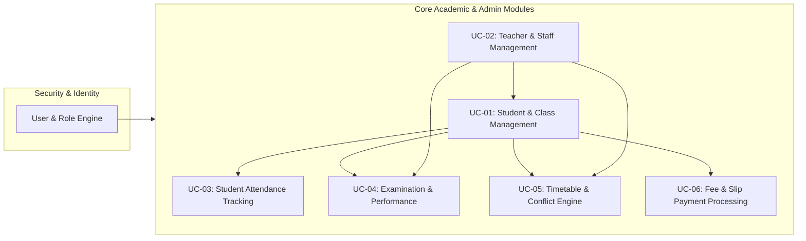
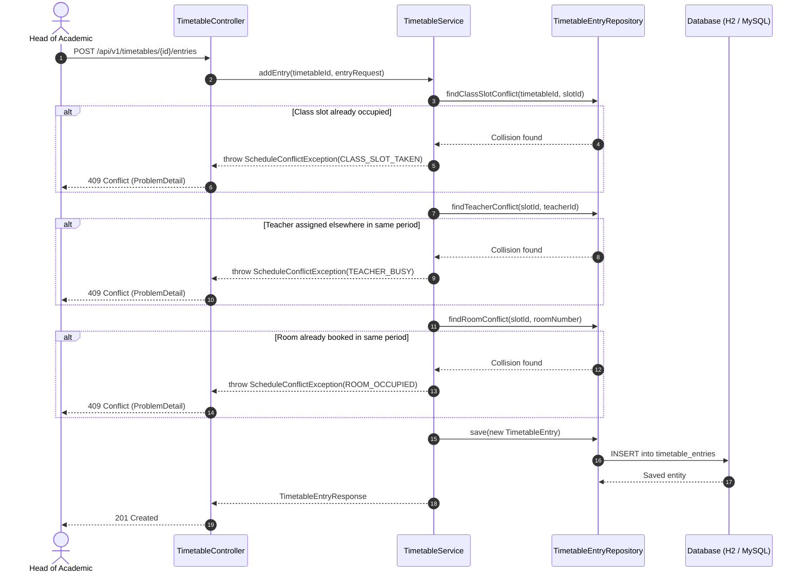

# Web-based School Information Management System (SIMS)

**Institution**: Sri Lanka Institute of Information Technology (SLIIT)  
**Module**: SE2030 – Software Engineering (Year 2, Semester 1 – 2026)  
**Group ID**: `2026 – Y2 – S1 – MLB – B3G2 – 01`  
**Database Architecture Model**: [Interactive Draw.io Diagram](https://app.diagrams.net/?grid=0&pv=0&border=10&edit=_blank#create=%7B%22type%22%3A%22mermaid%22%2C%22compressed%22%3Atrue%2C%22data%22%3A%22tVhbs6I4EP418zhVp848zDMis%2BuuRy3Fqp2nVBuiZgcIk4Rzxn%2B%2FHfASMAFk1iqrBNN8dn99h8kph4OE7NNL8On1BT%2FbTbQ2V19D%2FHz%2BLMzF68sm3k6jRWwOvtSCr0dQeFFIsecpw%2FsehDgKwj%2Frg5EIq2A9VIWb6A1i4jbjUIJMOOR4J%2FY2RhAG0%2BhtFpJwHmw2Xqz6mATz%2BTIM4tlyYYNTkWvgubJxLR0eBwSl%2BCFnCd5pYaNa9DZZuzfjgpVBDgdmGKxopCmCG1wG9MhkL%2FjkdkA228lfURgT%2FIfZH4u3FsU3pS0W6ifGQmooD0eN1zx%2FxGfDwI9CafUIbBDH0WIaLMKIrKNwuZ42aZY%2FKoftxTBSO9EwopKS6gpwd2oo6XrsjFx9t7DR6PV3GzphGKvpsFjtwgGtWZ5ATtm90dE%2FwdtscQ3rtnrmmKyCVbNOUJEVkiumBgWQG4O9Q1pCzVszZpryDqx1tNnOGwEiGRUyGcaUB0IhgsuJfQE8e4viYDKPmlhHlpSpM8hs%2BTbb18N7H%2FKcpmXSZNyIk818GT%2BIJSgtZVVm9LAK4IdS5e5fRvUDydRpo9LSnUvfIrQ0Xm%2FDeLuO7kEvldqIBWG43Dbrx46ntTPKPGkW0t7a70EUH8wVbW3xJuYq%2BG4qG7pstrLBCuBGuXcOQ1qmDwVdkXHtIq%2F9RLuL16dYo6LZqtmKWc4k5ujF1LtxYHL9qf7s%2BIHnVRcwWqz%2Bbh2je3l%2BMH5QTOaQmXq09QqxDKtfp0SBjewDE993LgVOIS0NBf5WDRdANX%2B3jr9ObRPtwHjQyuuxsZJUMt%2B8JkCScezGIid5me1McHbYu%2BdSaVIR55HAkcEpkKAXzZfY%2BZ5EX5vc8JhSgGS5vjemSZqd9M8kjWVFKk6MPZezq8DPElK%2B5xQ0%2BsknpDToUvmYsZL5mcTsQeOk2GlMJnpFiqPIvYc5py2%2Bm5Y6GuaDFtdnuAMljKTsnaU%2BVaoB2WVJjQAUETJOyYlBO7BrCQoFUK5PPv3qPzjP333B37UtjHa60tj0XYnnUtQt1E%2FGuThAmgpqJjJS%2FTAqzu0ZYmxzOM8UhIqku0FcBL0R4IwhZ8nyLCCj%2FeaNmZZ7zxY8y72t1HQuJGNN7FJqIA%2BXwLvuJ67I64%2FfW0%2FnimAMm%2B2un4Lr%2BDmaAUvvegHpdXdnNntTrHkqmVlgvRnYXujGZiH7BZk%2FszST2cN%2BGlhDWvvfWO9UBvxW%2FvU1ooRRnoEZUTP4RXq9Yi2dv2dUAcWA0tIZa7bqqDYRO%2FNajHkn6YqErrQryl3K1dGfec3F9xlFZ2jXd8TuwMhsLtxjMyuBExF78sHYD6d%2B6Fwuksts25TQvFqaUE2pSXXjPMey1Dr1OON%2FqILmfzTsUtbbC1CQqFT0truBXbG7t1hLoMjuyGzScf92Yaxv97iU6FPxwDjSSkfIRInCo3u870XEkwdQY3f98qaUvkC4GamFhpQ4Tb0JmbcifTI7SKv26xQbvJq13o6MpcpwAJQaTfro8q3TLb1TXhC09MBIKftChlRvkTxI71hSLgssGUaH9TpoNCMFnDJjZ21IT5oyynihO1Z6Mxue6xtXquzZUy54jmz0Z1tFxX8%3D%22%7D) | [Database Specification Document](docs/DATABASE_ARCHITECTURE.md)

---

## 1. System Overview & Module Roster

The Web-based School Information Management System is an enterprise educational management solution built with **Java 17+ and Spring Boot 3.2**. The system provides centralized administration, academic tracking, scheduling, examination evaluation, and finance workflows across 6 core subsystems:



| IT Number | Student Name | Subsystem / Assigned Use Case | Primary Actor |
| :--- | :--- | :--- | :--- |
| **IT25100975** | Dissanayake D.M.R.S | **UC-01**: Student Registration & Class Allocation | Head of Academic |
| **IT25102861** | Bandara R.M.K.G.R.L | **UC-02**: Teacher & Staff Management | Administrator |
| **IT25101863** | Dissanayake D.M.S.A | **UC-03**: Student Attendance Management | Teacher |
| **IT25103724** | Pemadasa J.M.C.D | **UC-04**: Examination Results & Grading Engine | Teacher |
| **IT25101913** | Gimhana D.B.C *(Lead)* | **UC-05**: Timetable & Academic Scheduling | Head of Academic |
| **IT25103710** | Weerasekara K.T.J | **UC-06**: Student Fees & Slip Verification | Administrator |

---

## 2. Technical Stack & Architectural Decisions

- **Runtime & Language**: Java 17 (LTS)
- **Framework**: Spring Boot 3.2.3
- **Persistence & ORM**: Spring Data JPA / Hibernate 6
- **Data Stores**:
  - **H2 In-Memory Database**: Embedded zero-configuration runtime for local development, automated testing, and evaluation runs.
  - **MySQL 8.0**: Production persistence profile with connection pooling via HikariCP.
- **API Standards**: RESTful JSON endpoints utilizing **RFC 7807 Problem Details** for HTTP error semantics.
- **Validation**: Jakarta Bean Validation (`@NotNull`, `@Min`, `@Max`, `@Size`).
- **Data Transfer**: Java 17 immutable `record` components for zero-boilerplate DTO encapsulation.

---

## 3. Codebase Directory Structure

```
server/
├── pom.xml                                  # Maven dependencies & build lifecycle
├── .mvn/wrapper/                            # Self-contained Maven wrapper binaries
└── src/
    ├── main/
    │   ├── java/com/sliit/sims/
    │   │   ├── SimsApplication.java         # Spring Boot entry point
    │   │   │
    │   │   ├── common/exception/            # System-wide exception infrastructure
    │   │   │   ├── ResourceNotFoundException.java
    │   │   │   ├── ScheduleConflictException.java
    │   │   │   └── GlobalExceptionHandler.java (RFC 7807 ProblemDetail handler)
    │   │   │
    │   │   └── timetable/                   # UC-05: Scheduling & Conflict Subsystem
    │   │       ├── TimetableDataSeeder.java # Automatic 40-slot period & demo seeder
    │   │       ├── controller/
    │   │       │   └── TimetableController.java
    │   │       ├── dto/                     # Java 17 immutable records
    │   │       │   ├── TimetableCreateRequest.java
    │   │       │   ├── TimetableEntryRequest.java
    │   │       │   ├── TimetableResponse.java
    │   │       │   ├── TimetableEntryResponse.java
    │   │       │   └── ConflictValidationResponse.java
    │   │       ├── model/                   # JPA domain entities & enums
    │   │       │   ├── DayOfWeek.java       (MONDAY .. FRIDAY)
    │   │       │   ├── TimetableStatus.java (DRAFT, PUBLISHED, ARCHIVED)
    │   │       │   ├── TimeSlot.java        (Period & time boundary entity)
    │   │       │   ├── Timetable.java       (Class & term schedule header)
    │   │       │   └── TimetableEntry.java  (Period slot assignment)
    │   │       ├── repository/              # Spring Data JPA repositories
    │   │       │   ├── TimeSlotRepository.java
    │   │       │   ├── TimetableRepository.java
    │   │       │   └── TimetableEntryRepository.java (Indexed conflict queries)
    │   │       └── service/
    │   │           └── TimetableService.java (Multi-constraint validation engine)
    │   │
    │   └── resources/
    │       └── application.properties       # Environment & persistence settings
    │
    └── test/java/com/sliit/sims/timetable/
        └── service/
            └── TimetableServiceTest.java    # Unit tests for collision rules
```

---

## 4. Deep Dive: Scheduling & Collision Engine (`timetable`)

The scheduling subsystem solves the multi-constraint timetabling problem by preventing resource collisions across three dimensions before any database mutation occurs.

### Conflict Detection Architecture



### Indexed Conflict Queries (`TimetableEntryRepository`)
Rather than pulling hundreds of schedule records into memory and evaluating nested iteration loops, the repository executes indexed JPQL queries directly at the database layer:

- **Teacher Availability Check**:
  ```sql
  SELECT e FROM TimetableEntry e 
  WHERE e.timeSlot.id = :slotId 
    AND e.teacherId = :teacherId 
    AND e.timetable.status != 'ARCHIVED'
  ```
- **Room Availability Check**:
  ```sql
  SELECT e FROM TimetableEntry e 
  WHERE e.timeSlot.id = :slotId 
    AND LOWER(e.roomNumber) = LOWER(:roomNumber) 
    AND e.timetable.status != 'ARCHIVED'
  ```
- **Class Period Duplicate Check**:
  ```sql
  SELECT e FROM TimetableEntry e 
  WHERE e.timetable.id = :timetableId 
    AND e.timeSlot.id = :slotId
  ```

---

## 5. REST API Endpoint Reference

All endpoints are rooted at `/api/v1/timetables`:

| Method | Endpoint | Request Body | Response Status | Description |
| :--- | :--- | :--- | :--- | :--- |
| `POST` | `/api/v1/timetables` | `TimetableCreateRequest` | `201 Created` | Creates a new draft timetable for a class and term. |
| `GET` | `/api/v1/timetables/{id}` | — | `200 OK` | Retrieves timetable details including all period allocations. |
| `GET` | `/api/v1/timetables/class/{classId}` | — | `200 OK` | Retrieves all timetables associated with a specific class. |
| `POST` | `/api/v1/timetables/{id}/entries` | `TimetableEntryRequest` | `201 Created` / `409 Conflict` | Allocates a subject, teacher, and room to a time slot. |
| `POST` | `/api/v1/timetables/{id}/validate-slot` | `TimetableEntryRequest` | `200 OK` | Dry-run validation endpoint for UI checks without saving. |
| `DELETE` | `/api/v1/timetables/{id}/entries/{entryId}` | — | `204 No Content` | Removes a scheduled period from the timetable. |
| `PATCH` | `/api/v1/timetables/{id}/publish` | — | `200 OK` / `400 Bad Request` | Publishes the timetable (enforces non-empty check). |
| `GET` | `/api/v1/timetables/teacher/{teacherId}` | — | `200 OK` | Fetches a teacher's combined weekly schedule across classes. |
| `GET` | `/api/v1/timetables/room/{roomNumber}` | — | `200 OK` | Fetches room occupancy schedule. |
| `GET` | `/api/v1/timetables/slots` | — | `200 OK` | Returns all 40 standard weekly time slots (Periods 1–8). |

---

## 6. Build, Test & Execution Guide

### Running Automated Tests
The test suite validates constraint validation, exception handling, and conflict detection rules:
```bash
cd server
./mvnw test
```

### Running the Application Locally
```bash
cd server
./mvnw spring-boot:run
```
The server starts on port `8080`.

### Seeded Data & Embedded H2 Console
Upon application launch, `TimetableDataSeeder` automatically populates:
- 40 weekly time slots (Monday through Friday, Periods 1 to 8).
- A sample draft timetable for **Class 1 (Grade 10-A, 2026, Term 1)** with period allocations.

Access the interactive H2 Database console at:
- **URL**: `http://localhost:8080/h2-console`
- **JDBC URL**: `jdbc:h2:mem:simsdb`
- **User Name**: `sa`
- **Password**: *(leave blank)*
