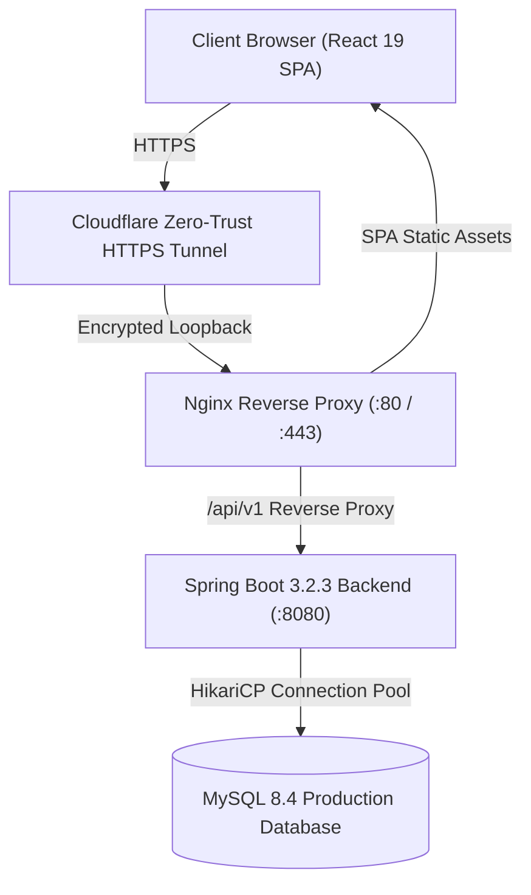

# Web-based School Information Management System (SIMS)

**Institution**: Sri Lanka Institute of Information Technology (SLIIT)  
**Module**: SE2030 – Software Engineering (Year 2, Semester 1 – 2026)  
**Group ID**: `2026 – Y2 – S1 – MLB – B3G2 – 01`  
**Client Target**: Wycherley International School, Gampaha  
**Live Production URL**: [https://client.flextvx.xyz](https://client.flextvx.xyz)  
**Architecture Specification**: [Interactive Draw.io Diagram](https://app.diagrams.net/?grid=0&pv=0&border=10&edit=_blank#create=%7B%22type%22%3A%22mermaid%22%2C%22compressed%22%3Atrue%2C%22data%22%3A%221Vlbc5s4FP41mek%2BJJM4M%2B2%2ByhgnbIntAdzZPGlkUBxtuS2ItP73KyEINwEiJpPslAZhpHPQ%2Bc5N5%2BBkRdAxQcHFNbhYXL9ee1u3bD78prHr8jLig8W17exX%2BsbJ39yKBYsbNrphwy9ZihNIPDZcf%2F%2BDvVAj6ehAuy%2FezERyB6y3fmRtaUVzObDzDScaowSHtE22Sbm%2Bz%2BbnAg2s9AdDg5oJbFuXfneAQnTEKWfm%2BihNIcXIfR7cioysdE9iAgSmudWAY2w38k0Kvv386hI6h09KM%2B%2BN0lxWb6C9X%2F6law5kLI27zUMvduOCLCjNwCvNDv9gt7O1SaBN5SmFbSpT4Dj6ZgU2mg4tXdtaq7epSD9qagwClPzEHjyc1ICTEy0Y5%2FcWayZEy%2BgaYL43RCkOPRS6GCbYjRLvTaagyEzJBvS%2FwYOxqSypvTH%2BHu7ATuJccyb4NwrepPZjhMfVvEVB%2BuWWbu%2FNHqXOPz1G8bDd9qIwSl9J%2Fgq2ajzoDliaPSiPmktjeVtIr28HNYmSAFN08PEIH2ibW%2BdMPjD1oyHUBxypEo9xvRoIC2q7kPuUJpO1zqTlWHvN2VtDYZXPA5q23fe55ifMREaTzKVZMoTPeGQdZdWj0F0mHVJNhjvwyEMN0xZj178p5LpRNsitN88aZyBPthq0WyTa2aF4zUKCbux60sQYnQLOJfVJPKwNVQ66bL2pXwdyJCFlg5zW7vvA1BeUuM8oYSOeq4YowJyL2gocIOKrT4%2BZ%2F%2FnFQpnS5CTysZASWLG4c7HgwrzXwQpu17D0heLXwgzFQ6FY4kHg3sWsIauIcUIhGyGXkhc8MJV7nZSiIGZjN8GIsuwA0faCb6subA2bmgm516n1Q4YQWX6%2FvLjVS435QjyJ6solj7yApCmJQhhmwQEn6gA%2FkSSlMNchleksHo3O9piQ%2BS06KJE8sqSJfbGC0Jp23RVb4TJ6BCfDuBENPjnGOIj96MR85yeAuJr9b4Z88kRcRJn2Ka1g1kizVAgEaI7xQxeGzxLV4kkJunp8%2BOTIPSHKUwZlmQbRtPnxcxSqzQyJK9UbmYClyetMkhbzjgnyMPTxC%2FaFlO%2F4D2z4lf2nEftzc6sqY5EpF7GQLcJXxytO4PoSDJMQn4JcxjkgLjzhnFxFgf37qkLBRTFyCT2pCEhaoOkqWumdJji0wULK7HbSyhm7Oyhj6Li1tGTTS7GtleOUZQCPBi%2Fk%2B5GbJwv5D%2Bf4NccCG3utW5a%2BUgWxfgqaPWcsz0hu5E3IG8tVI06pa9jqUbivYDW72p5reFJTaJ48uzRLUD%2B5KUgjgbxKNjcss2%2F3PQAv%2FUNV6xtxENPcT3WyISlkLugn7hy9RhCqFS9mR6i3wilBq6MzU4xpvrgi9887S7dfT5xgWY1N4MgSUCnBBPNqc6qCT6cQO7tXz%2BudSs6Z4iQQUrgRe16I20iqNU2P5WJfWWBdHvP3S9Ow75VjYrsePLdq10vdXX2r4%2FcxQWE0sNYuD7skQDynDtBvOElJ6zXv95FxoyYvl3SB88c4jLrwmOBgdKCIhF03LFX2Y3GA4SngxWJZ%2BBdxK56KApgtbmvVQhcLB3F28En6rBYRWp2BTx%2Brp7mXszzZ7L6p1R2Z3bd76ASjJ%2FgL45%2FiWx%2B2LLQ%2BXl2tLYPdVQTLbI5EXlU64jK7uvpzeCmvnQopJRTmD6NzWXognTmoou%2Bas3TaW11trWxlSk7ZbmfJ6Qq9%2BOCDxIz5b73aHwWlQimgLemJzW4ovLNET3HhgZ29wQN24WiBZpiG8yieeJR5j3iLAt7Vmv8E1tt6%2Bz9UdKRNzC7lpoJMCdQ0osiHo7KvFsSIeFPmH5CfH3pGl%2FScNthJyNjcvfa3HAOY5YOhGmS6Pcu5sZf0ZXvxb2jiBF04r4Ujl3TegA3QEcMsmWKmkKuBEosXFj3LHgfsRRbsdtb2B88a%2BJOlcy%2BtnEPIes6zIyzrWcswqGnapIiAXUxiqtigqndmSZpmU2qtJafK2a%2F3ptkyMDXnIbfpHKL%2FAA%3D%3D%22%7D) | [SQL DDL Script](database/schema.sql)

---

## 1. Executive Summary & Team Roster

The **Web-Based School Information Management System (SIMS)** is an enterprise academic administration and decision-support web platform designed for Wycherley International School Gampaha. Built on an enterprise Java backend and a responsive modern React Single Page Application (SPA), SIMS centralizes student life-cycle management, academic staff administration, daily digital attendance, conflict-free timetable scheduling, examination evaluation with automatic grading, and school fee management with official receipt generation.

### Team Members & Module Ownership

| Student ID | Full Name | Major Subsystem / Use Case | Assigned Branch | Primary Actors |
| :--- | :--- | :--- | :--- | :--- |
| **IT25100975** | Dissanayake D.M.R.S | **UC-01**: Student Registration & Class Allocation | `feature/uc01-student-management` | School Administrator, Head of Academic |
| **IT25102861** | Bandara R.M.K.G.R.L | **UC-02**: Teacher & Staff Management | `feature/uc02-teacher-management` | School Administrator, Head of Academic |
| **IT25101863** | Dissanayake D.M.S.A | **UC-03**: Student Attendance Management | `feature/uc03-attendance-management` | Teacher, Principal, Parent |
| **IT25103724** | Pemadasa J.M.C.D | **UC-04**: Examination Performance & Grading | `feature/uc04-exam-performance` | Teacher, Head of Academic, Student |
| **IT25101913** | Gimhana D.B.C *(Lead)* | **UC-05**: Timetable & Academic Scheduling | `feature/uc05-timetable-scheduling` | Head of Academic, Teacher, Student |
| **IT25103710** | Weerasekara K.T.J | **UC-06**: Fee & Payment Management | `feature/uc06-fee-payment-management` | School Administrator, Parent |

---

## 2. System Architecture & Technology Stack



- **Frontend**: React 19, Vite 8, Tailwind CSS v4, Axios, React Router v7
- **Backend**: Java 21 / 17, Spring Boot 3.2.3, Spring Data JPA, Spring Security (Stateless JWT), Hibernate 6
- **Database**: MySQL 8.4 LTS (with UTF-8 Multilingual Collation & strict foreign key constraints)
- **Deployment**: Linux Ubuntu 24.04 VPS, systemd service daemon, Nginx reverse proxy, Cloudflare Zero Trust Tunnel

---

## 3. Six Major Functional Modules & CRUD Alignment

Every one of the 6 modules provides at least **3 distinct CRUD operations / entities** with dedicated user interfaces:

### 3.1 Student & Class Management (UC-01)
1. **Student Registration CRUD**:
   - **Create**: Register new student (`+ Register Student` modal) with admission number, name, DOB, gender.
   - **Read**: Live search by name or admission number, and filter by grade level (Grades 10–13).
   - **Update**: Edit personal details (`Edit` modal).
   - **Delete**: Soft-delete/deactivate student records with verification prompt.
2. **Academic Classes CRUD**:
   - **Create**: Create new classes (`+ Create Class` modal) with grade level, section name, academic year, and capacity.
   - **Read**: View classes and current student allocation tallies.
3. **Class Allocation CRUD**:
   - **Create / Update**: Assign or re-allocate students across classes (`Class` allocation modal).
   - **Read**: Class-wise student rosters.

### 3.2 Teacher & Staff Management (UC-02)
1. **Teacher Profiles CRUD**:
   - **Create**: Register new teaching staff with employee number, qualification, contact number, and hire date.
   - **Read**: Directory search with real-time text and status filters.
   - **Update**: Edit qualifications, phone number, and profile attributes.
   - **Delete**: Remove or deactivate teacher records.
2. **Operational Status Lifecycle CRUD**:
   - **Update**: Quick status toggle dropdown (`ACTIVE`, `ON_LEAVE`, `INACTIVE`) via dedicated REST endpoint.
   - **Read**: Staff KPI metrics (Active count, On Leave count).
3. **Subject & Academic Assignment CRUD**:
   - **Create**: Add curriculum subjects with subject codes and grade levels.
   - **Create / Update**: Assign teachers to subjects, classes, and academic years.
   - **Read**: View teacher curriculum allocations.

### 3.3 Student Attendance Management (UC-03)
1. **Daily Attendance Sheet CRUD**:
   - **Create**: Mark class attendance batch sheets (`PRESENT`, `ABSENT`, `LATE`).
   - **Read**: Retrieve class attendance for any date.
   - **Update (Correction Mode)**: Loading an already-recorded date enables Edit Mode, permitting teachers to correct mistakes and update attendance.
2. **Class Attendance Reporting CRUD**:
   - **Read**: Daily attendance percentage metrics, total enrolled, present count, and absent counts.
3. **Individual Student Longitudinal Profile**:
   - **Read**: Cumulative attendance rate (%) with visual status progress bar (Satisfactory vs. At Risk).

### 3.4 Timetable & Academic Scheduling (UC-04)
1. **Class Timetable CRUD**:
   - **Create**: Initialize class timetable for academic year and term (`+ Initialize Class Timetable`).
   - **Read**: Interactive 5-day x 8-period weekly schedule matrix.
   - **Update**: Publish timetable for school-wide visibility.
2. **Period Slot Entry CRUD**:
   - **Create**: Interactive slot assignment modal linking Day, Period (1-8), Subject, Teacher, and Classroom.
   - **Read**: Grid visualization with room and teacher allocations.
   - **Delete**: Direct `×` deletion on any scheduled period cell.
3. **Teacher & Room Schedule Views**:
   - **Read**: Teacher schedule queries and room conflict validation.

### 3.5 Examination & Academic Performance (UC-05)
1. **Examination Definition CRUD**:
   - **Create**: Create exam headers with name, term, and academic year.
   - **Read**: Exam registry with Draft / Published badges.
   - **Update**: Result publication action.
2. **Exam Paper Configuration CRUD**:
   - **Create**: Configure subject papers per exam with maximum marks.
   - **Read**: View configured papers.
3. **Batch Marks Entry & Grading CRUD**:
   - **Create / Update**: Interactive batch marks entry with **automatic letter grade calculation** (`A+`, `A`, `B`, `C`, `S`, `F`) and remarks.
   - **Reports & Analytics**:
     - **Student Report Card**: Comprehensive transcript with subject scores, grades, total marks, averages, and pass/fail indicators.
     - **Class Analytics**: Evaluated candidate count, batch average, pass rate %, grade distribution, and **Class Merit Ranking** (Rank #1 🥇, #2 🥈, #3 🥉).

### 3.6 Fee & Payment Management (UC-06)
1. **Fee Structures CRUD**:
   - **Create**: Create institutional fees (Tuition, Facility, Examination, Library, Admission, Transport, Activity, Other).
   - **Read**: Filter structures by academic year or grade level.
   - **Update**: Modify fee amounts, descriptions, and due dates.
   - **Delete**: Remove unused fee structures.
2. **Student Fee Accounts CRUD**:
   - **Create**: Assign fee structures to students.
   - **Read**: View invoiced amounts, paid amounts, and arrears.
   - **Delete / Cancel**: Cancel unpaid fee accounts.
3. **Payment Transactions & Official Receipts CRUD**:
   - **Create**: Record direct counter payments (Cash, Bank Transfer, Deposit, Cheque).
   - **Read**: Transaction histories and outstanding balances.
   - **Print / Read**: Generate and view **Official Payment Receipts** with unique receipt numbers and remaining balance tracking.

---

## 4. Minor Functions: Executive Reports Hub (`/reports`)

Aligned directly with Section 8 of the proposal, the system includes a dedicated Executive Reporting Hub:
- **Financial Reports**: Total Invoiced, Total Collected, Arrears, Recovery Rate %, Fee Category Breakdown, Grade-Level Collection Tables, and Accounts in Arrears.
- **Academic Analytics**: Candidate evaluations, batch averages, pass rate %, grade distributions, and merit lists.
- **Attendance Summaries**: Daily class attendance rate metrics and individual student attendance records.
- **Printable**: Integrated one-click print triggers on all report views.

---

## 5. Security & Role-Based Access Control (RBAC)

The system enforces role-based access control across all 5 user roles:

| Role | Dashboard | Students | Teachers | Attendance | Exams | Timetable | Fees | Reports |
| :--- | :---: | :---: | :---: | :---: | :---: | :---: | :---: | :---: |
| **Administrator** | Full | Full CRUD | Full CRUD | View/Edit | Full CRUD | Full CRUD | Full CRUD | Full |
| **Head of Academic** | Full | Full CRUD | View/Assign | View/Edit | Full CRUD | Full CRUD | *Restricted* | Full |
| **Teacher** | Assigned | View | View | Full Mark | Marks Entry | View Schedule | *Restricted* | Academic |
| **Student** | Student | View Own | View | View Own | Report Card | View Class | View Own | *Restricted* |
| **Parent** | Parent | View Child | View | View Child | Report Card | View Class | Pay / Receipts | *Restricted* |

### Pre-Configured Demo Credentials

| Role | Username | Password | Notes |
| :--- | :--- | :--- | :--- |
| **Administrator** | `admin` | `admin123` | Full access across all 6 subsystems |
| **Head of Academic** | `head_academic` | `academic123` | Academic management, restricted from finance |
| **Teacher** | `teacher1` | `teacher123` | Attendance marking, marks entry, timetable lookup |
| **Student** | `student1` | `student123` | Self-service results, timetable, and attendance |
| **Parent** | `parent1` | `parent123` | Child progress tracking, receipts, fee payments |

---

## 6. Git Branching Strategy & Pull Request Workflow

In accordance with software engineering practices, changes are developed on dedicated feature branches and submitted via **Pull Requests into the `develop` integration branch** before releases to `main`:

```
main (production releases)
  ↑
develop (central integration branch)
  ↑
  ├── feature/uc01-student-management
  ├── feature/uc02-teacher-management
  ├── feature/uc03-attendance-management
  ├── feature/uc04-exam-performance
  ├── feature/uc05-timetable-scheduling
  └── feature/uc06-fee-payment-management
```

### Pull Request Links for Evaluation Review:
- **UC-01 Student Management**: [Compare `develop...feature/uc01-student-management`](https://github.com/ChalanaGimhanaX/Webbased-School-Information-Management-System/compare/develop...feature/uc01-student-management)
- **UC-02 Teacher Management**: [Compare `develop...feature/uc02-teacher-management`](https://github.com/ChalanaGimhanaX/Webbased-School-Information-Management-System/compare/develop...feature/uc02-teacher-management)
- **UC-03 Attendance Management**: [Compare `develop...feature/uc03-attendance-management`](https://github.com/ChalanaGimhanaX/Webbased-School-Information-Management-System/compare/develop...feature/uc03-attendance-management)
- **UC-04 Exam Performance**: [Compare `develop...feature/uc04-exam-performance`](https://github.com/ChalanaGimhanaX/Webbased-School-Information-Management-System/compare/develop...feature/uc04-exam-performance)
- **UC-05 Timetable Scheduling**: [Compare `develop...feature/uc05-timetable-scheduling`](https://github.com/ChalanaGimhanaX/Webbased-School-Information-Management-System/compare/develop...feature/uc05-timetable-scheduling)
- **UC-06 Fee Payment Management**: [Compare `develop...feature/uc06-fee-payment-management`](https://github.com/ChalanaGimhanaX/Webbased-School-Information-Management-System/compare/develop...feature/uc06-fee-payment-management)

---

## 7. Local Setup & Execution Guide

### Prerequisites
- JDK 21 or 17
- Node.js 18+ & npm
- MySQL 8.0+

### Backend Setup
```bash
cd server
# Ensure MySQL is running and sim_system_db is created via database/schema.sql
./mvnw clean spring-boot:run
# Server starts on http://localhost:8080
```

### Frontend Setup
```bash
cd client
npm install
npm run dev
# React app available on http://localhost:5173
```
