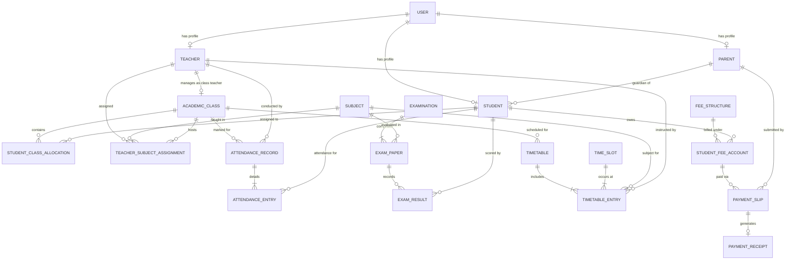
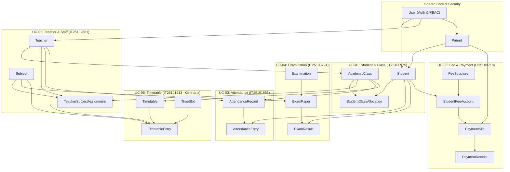

# Database Architecture & Entity-Relationship Model (Spring Boot JPA)

**Project**: Web-based School Information Management System  
**Module**: SE2030 – Software Engineering (SLIIT Year 2, Semester 1)  
**Backend Framework**: Java Spring Boot (Spring Data JPA + Hibernate)  
**Interactive Draw.io Diagram Link**: [Open Database Diagram in Draw.io Editor](https://app.diagrams.net/?grid=0&pv=0&border=10&edit=_blank#create=%7B%22type%22%3A%22mermaid%22%2C%22compressed%22%3Atrue%2C%22data%22%3A%22tVhbs6I4EP418zhVp848zDMis%2BuuRy3Fqp2nVBuiZgcIk4Rzxn%2B%2FHfASMAFk1iqrBNN8dn99h8kph4OE7NNL8On1BT%2FbTbQ2V19D%2FHz%2BLMzF68sm3k6jRWwOvtSCr0dQeFFIsecpw%2FsehDgKwj%2Frg5EIq2A9VIWb6A1i4jbjUIJMOOR4J%2FY2RhAG0%2BhtFpJwHmw2Xqz6mATz%2BTIM4tlyYYNTkWvgubJxLR0eBwSl%2BCFnCd5pYaNa9DZZuzfjgpVBDgdmGKxopCmCG1wG9MhkL%2FjkdkA228lfURgT%2FIfZH4u3FsU3pS0W6ifGQmooD0eN1zx%2FxGfDwI9CafUIbBDH0WIaLMKIrKNwuZ42aZY%2FKoftxTBSO9EwopKS6gpwd2oo6XrsjFx9t7DR6PV3GzphGKvpsFjtwgGtWZ5ATtm90dE%2FwdtscQ3rtnrmmKyCVbNOUJEVkiumBgWQG4O9Q1pCzVszZpryDqx1tNnOGwEiGRUyGcaUB0IhgsuJfQE8e4viYDKPmlhHlpSpM8hs%2BTbb18N7H%2FKcpmXSZNyIk818GT%2BIJSgtZVVm9LAK4IdS5e5fRvUDydRpo9LSnUvfIrQ0Xm%2FDeLuO7kEvldqIBWG43Dbrx46ntTPKPGkW0t7a70EUH8wVbW3xJuYq%2BG4qG7pstrLBCuBGuXcOQ1qmDwVdkXHtIq%2F9RLuL16dYo6LZqtmKWc4k5ujF1LtxYHL9qf7s%2BIHnVRcwWqz%2Bbh2je3l%2BMH5QTOaQmXq09QqxDKtfp0SBjewDE993LgVOIS0NBf5WDRdANX%2B3jr9ObRPtwHjQyuuxsZJUMt%2B8JkCScezGIid5me1McHbYu%2BdSaVIR55HAkcEpkKAXzZfY%2BZ5EX5vc8JhSgGS5vjemSZqd9M8kjWVFKk6MPZezq8DPElK%2B5xQ0%2BsknpDToUvmYsZL5mcTsQeOk2GlMJnpFiqPIvYc5py2%2Bm5Y6GuaDFtdnuAMljKTsnaU%2BVaoB2WVJjQAUETJOyYlBO7BrCQoFUK5PPv3qPzjP333B37UtjHa60tj0XYnnUtQt1E%2FGuThAmgpqJjJS%2FTAqzu0ZYmxzOM8UhIqku0FcBL0R4IwhZ8nyLCCj%2FeaNmZZ7zxY8y72t1HQuJGNN7FJqIA%2BXwLvuJ67I64%2FfW0%2FnimAMm%2B2un4Lr%2BDmaAUvvegHpdXdnNntTrHkqmVlgvRnYXujGZiH7BZk%2FszST2cN%2BGlhDWvvfWO9UBvxW%2FvU1ooRRnoEZUTP4RXq9Yi2dv2dUAcWA0tIZa7bqqDYRO%2FNajHkn6YqErrQryl3K1dGfec3F9xlFZ2jXd8TuwMhsLtxjMyuBExF78sHYD6d%2B6Fwuksts25TQvFqaUE2pSXXjPMey1Dr1OON%2FqILmfzTsUtbbC1CQqFT0truBXbG7t1hLoMjuyGzScf92Yaxv97iU6FPxwDjSSkfIRInCo3u870XEkwdQY3f98qaUvkC4GamFhpQ4Tb0JmbcifTI7SKv26xQbvJq13o6MpcpwAJQaTfro8q3TLb1TXhC09MBIKftChlRvkTxI71hSLgssGUaH9TpoNCMFnDJjZ21IT5oyynihO1Z6Mxue6xtXquzZUy54jmz0Z1tFxX8%3D%22%7D)

---

## 1. Unified Entity-Relationship Diagram (Mermaid ER)

---

## 2. Module Ownership & Cross-Component Connections

Notice how the 6 members' entities connect into a single unified database:

---

## 3. Detailed Entity Specs for Spring Boot (JPA)

### Core & Auth Entities (Shared)
1. **`User`**:
   - `id`: `Long` (@Id @GeneratedValue)
   - `username`: `String` (@Column(unique = true))
   - `email`: `String` (@Column(unique = true))
   - `password`: `String` (BCrypt encoded)
   - `role`: `Role` (Enum: `ADMIN`, `HEAD_OF_ACADEMIC`, `TEACHER`, `STUDENT`, `PARENT`)
   - `active`: `Boolean`

2. **`Parent`**:
   - `id`: `Long`
   - `user`: `@OneToOne User`
   - `fatherName`, `motherName`, `phone`, `nic`: `String`

---

### UC-01: Student & Class Management (IT25100975)
3. **`Student`**:
   - `id`: `Long`
   - `user`: `@OneToOne User`
   - `admissionNumber`: `String` (unique)
   - `firstName`, `lastName`: `String`
   - `dob`: `LocalDate`
   - `gender`: `String`
   - `parent`: `@ManyToOne Parent`
4. **`AcademicClass`**:
   - `id`: `Long`
   - `gradeLevel`: `Integer` (e.g. 6, 7, 8, 9, 10, 11)
   - `className`: `String` (e.g. "10-A", "11-B")
   - `academicYear`: `Integer` (e.g. 2026)
   - `capacity`: `Integer`
   - `classTeacher`: `@ManyToOne Teacher` (from UC-02)
5. **`StudentClassAllocation`**:
   - `id`: `Long`
   - `student`: `@ManyToOne Student`
   - `academicClass`: `@ManyToOne AcademicClass`
   - `allocatedDate`: `LocalDate`
   - `status`: `AllocationStatus` (`ACTIVE`, `TRANSFERRED`)

---

### UC-02: Teacher & Staff Management (IT25102861)
6. **`Teacher`**:
   - `id`: `Long`
   - `user`: `@OneToOne User`
   - `employeeNumber`: `String` (unique)
   - `firstName`, `lastName`: `String`
   - `qualification`: `String`
   - `status`: `TeacherStatus` (`ACTIVE`, `INACTIVE`, `ON_LEAVE`)
7. **`Subject`**:
   - `id`: `Long`
   - `subjectCode`: `String` (unique)
   - `subjectName`: `String` (e.g., "Mathematics", "Science")
   - `gradeLevel`: `Integer`
8. **`TeacherSubjectAssignment`**:
   - `id`: `Long`
   - `teacher`: `@ManyToOne Teacher`
   - `subject`: `@ManyToOne Subject`
   - `academicClass`: `@ManyToOne AcademicClass`
   - `academicYear`: `Integer`

---

### UC-03: Student Attendance Management (IT25101863)
9. **`AttendanceRecord`**:
   - `id`: `Long`
   - `academicClass`: `@ManyToOne AcademicClass`
   - `teacher`: `@ManyToOne Teacher` (who marked attendance)
   - `attendanceDate`: `LocalDate`
   - `academicYear`: `Integer`
   - `isLocked`: `Boolean` (prevent tamper after submission)
10. **`AttendanceEntry`**:
    - `id`: `Long`
    - `attendanceRecord`: `@ManyToOne AttendanceRecord`
    - `student`: `@ManyToOne Student`
    - `status`: `AttendanceStatus` (`PRESENT`, `ABSENT`, `LATE`)
    - `remarks`: `String` (Reason if late/absent or corrected)

---

### UC-04: Examination & Academic Performance (IT25103724)
11. **`Examination`**:
    - `id`: `Long`
    - `examName`: `String` (e.g., "First Term Examination 2026")
    - `term`: `Integer` (1, 2, 3)
    - `academicYear`: `Integer`
    - `status`: `ExamStatus` (`DRAFT`, `COMPLETED`, `PUBLISHED`)
12. **`ExamPaper`**:
    - `id`: `Long`
    - `examination`: `@ManyToOne Examination`
    - `subject`: `@ManyToOne Subject`
    - `gradeLevel`: `Integer`
    - `maxMarks`: `BigDecimal` (default 100)
13. **`ExamResult`**:
    - `id`: `Long`
    - `examPaper`: `@ManyToOne ExamPaper`
    - `student`: `@ManyToOne Student`
    - `marksObtained`: `BigDecimal`
    - `grade`: `String` ("A+", "A", "B", "C", "S", "F")
    - `isPublished`: `Boolean`

---

### UC-05: Timetable & Academic Scheduling (IT25101913 - Gimhana)
14. **`Timetable`**:
    - `id`: `Long`
    - `academicClass`: `@ManyToOne AcademicClass`
    - `academicYear`: `Integer`
    - `term`: `Integer`
    - `status`: `TimetableStatus` (`DRAFT`, `PUBLISHED`)
15. **`TimeSlot`**:
    - `id`: `Long`
    - `dayOfWeek`: `DayOfWeek` (`MONDAY`, `TUESDAY`, `WEDNESDAY`, `THURSDAY`, `FRIDAY`)
    - `periodNumber`: `Integer` (1 to 8)
    - `startTime`: `LocalTime` (e.g. 08:00)
    - `endTime`: `LocalTime` (e.g. 08:45)
16. **`TimetableEntry`** (Conflict-checked entry):
    - `id`: `Long`
    - `timetable`: `@ManyToOne Timetable`
    - `timeSlot`: `@ManyToOne TimeSlot`
    - `subject`: `@ManyToOne Subject`
    - `teacher`: `@ManyToOne Teacher`
    - `roomNumber`: `String` (e.g., "Lab 1", "Room 10B")
    - *Conflict Constraints Enforced in Service*:
      - Unique (`timeSlotId`, `teacherId`) -> Teacher cannot be double booked
      - Unique (`timeSlotId`, `roomNumber`) -> Room cannot have 2 classes
      - Unique (`timeSlotId`, `timetableId`) -> Class cannot have 2 subjects at once

---

### UC-06: Fee & Payment Management (IT25103710)
17. **`FeeStructure`**:
    - `id`: `Long`
    - `feeType`: `FeeType` (`TUITION`, `FACILITY`, `EXAMINATION`, `LIBRARY`)
    - `gradeLevel`: `Integer`
    - `amount`: `BigDecimal`
    - `academicYear`: `Integer`
18. **`StudentFeeAccount`**:
    - `id`: `Long`
    - `student`: `@ManyToOne Student`
    - `feeStructure`: `@ManyToOne FeeStructure`
    - `totalAmount`: `BigDecimal`
    - `paidAmount`: `BigDecimal`
    - `balanceAmount`: `BigDecimal`
    - `status`: `PaymentStatus` (`PENDING`, `PARTIAL`, `PAID`)
19. **`PaymentSlip`**:
    - `id`: `Long`
    - `feeAccount`: `@ManyToOne StudentFeeAccount`
    - `parent`: `@ManyToOne Parent`
    - `slipImageUrl`: `String`
    - `amountPaid`: `BigDecimal`
    - `verificationStatus`: `SlipStatus` (`PENDING`, `APPROVED`, `REJECTED`)
    - `reviewedBy`: `@ManyToOne User`
20. **`PaymentReceipt`**:
    - `id`: `Long`
    - `paymentSlip`: `@OneToOne PaymentSlip`
    - `receiptNumber`: `String` (unique)
    - `issuedDate`: `LocalDateTime`
    - `receiptType`: `ReceiptType` (`FULL`, `PARTIAL`)
    - `amount`: `BigDecimal`

