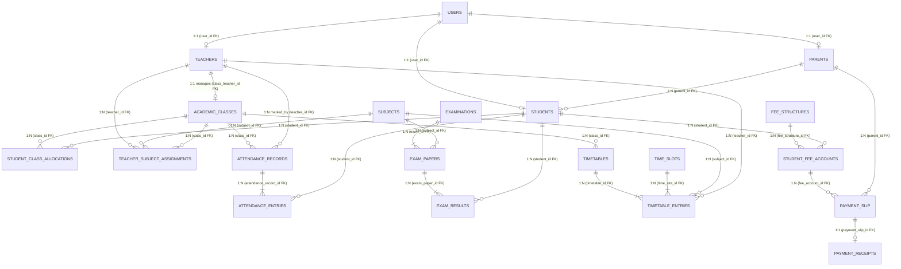
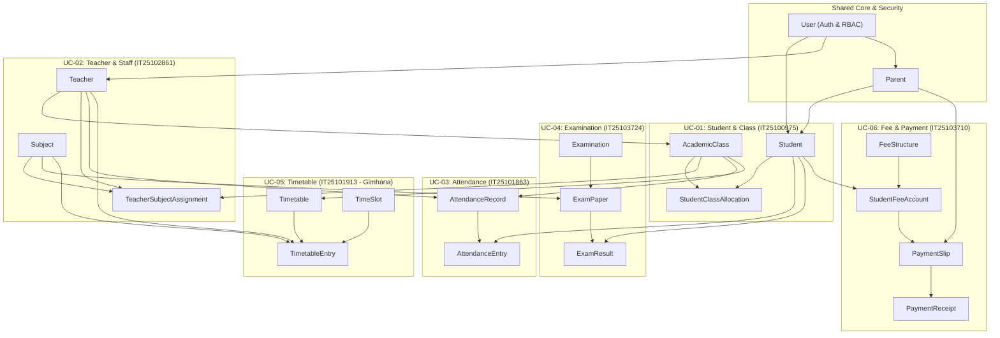

# Database Architecture & Entity-Relationship Model (Spring Boot JPA)

**Project**: Web-based School Information Management System  
**Module**: SE2030 – Software Engineering (Year 2, Semester 1)  
**Backend Framework**: Java Spring Boot (Spring Data JPA + Hibernate)  
**Interactive Draw.io Diagram Link**: [Open Clearly Pointing Database Diagram in Draw.io Editor](https://app.diagrams.net/?grid=0&pv=0&border=10&edit=_blank#create=%7B%22type%22%3A%22mermaid%22%2C%22compressed%22%3Atrue%2C%22data%22%3A%221Vlbc5s4FP41mek%2BJJM4M%2B2%2ByhgnbIntAdzZPGlkUBxtuS2ItP73KyEINwEiJpPslAZhpHPQ%2Bc5N5%2BBkRdAxQcHFNbhYXL9ee1u3bD78prHr8jLig8W17exX%2BsbJ39yKBYsbNrphwy9ZihNIPDZcf%2F%2BDvVAj6ehAuy%2FezERyB6y3fmRtaUVzObDzDScaowSHtE22Sbm%2Bz%2BbnAg2s9AdDg5oJbFuXfneAQnTEKWfm%2BihNIcXIfR7cioysdE9iAgSmudWAY2w38k0Kvv386hI6h09KM%2B%2BN0lxWb6C9X%2F6law5kLI27zUMvduOCLCjNwCvNDv9gt7O1SaBN5SmFbSpT4Dj6ZgU2mg4tXdtaq7epSD9qagwClPzEHjyc1ICTEy0Y5%2FcWayZEy%2BgaYL43RCkOPRS6GCbYjRLvTaagyEzJBvS%2FwYOxqSypvTH%2BHu7ATuJccyb4NwrepPZjhMfVvEVB%2BuWWbu%2FNHqXOPz1G8bDd9qIwSl9J%2Fgq2ajzoDliaPSiPmktjeVtIr28HNYmSAFN08PEIH2ibW%2BdMPjD1oyHUBxypEo9xvRoIC2q7kPuUJpO1zqTlWHvN2VtDYZXPA5q23fe55ifMREaTzKVZMoTPeGQdZdWj0F0mHVJNhjvwyEMN0xZj178p5LpRNsitN88aZyBPthq0WyTa2aF4zUKCbux60sQYnQLOJfVJPKwNVQ66bL2pXwdyJCFlg5zW7vvA1BeUuM8oYSOeq4YowJyL2gocIOKrT4%2BZ%2F%2FnFQpnS5CTysZASWLG4c7HgwrzXwQpu17D0heLXwgzFQ6FY4kHg3sWsIauIcUIhGyGXkhc8MJV7nZSiIGZjN8GIsuwA0faCb6subA2bmgm516n1Q4YQWX6%2FvLjVS435QjyJ6solj7yApCmJQhhmwQEn6gA%2FkSSlMNchleksHo3O9piQ%2BS06KJE8sqSJfbGC0Jp23RVb4TJ6BCfDuBENPjnGOIj96MR85yeAuJr9b4Z88kRcRJn2Ka1g1kizVAgEaI7xQxeGzxLV4kkJunp8%2BOTIPSHKUwZlmQbRtPnxcxSqzQyJK9UbmYClyetMkhbzjgnyMPTxC%2FaFlO%2F4D2z4lf2nEftzc6sqY5EpF7GQLcJXxytO4PoSDJMQn4JcxjkgLjzhnFxFgf37qkLBRTFyCT2pCEhaoOkqWumdJji0wULK7HbSyhm7Oyhj6Li1tGTTS7GtleOUZQCPBi%2Fk%2B5GbJwv5D%2Bf4NccCG3utW5a%2BUgWxfgqaPWcsz0hu5E3IG8tVI06pa9jqUbivYDW72p5reFJTaJ48uzRLUD%2B5KUgjgbxKNjcss2%2F3PQAv%2FUNV6xtxENPcT3WyISlkLugn7hy9RhCqFS9mR6i3wilBq6MzU4xpvrgi9887S7dfT5xgWY1N4MgSUCnBBPNqc6qCT6cQO7tXz%2BudSs6Z4iQQUrgRe16I20iqNU2P5WJfWWBdHvP3S9Ow75VjYrsePLdq10vdXX2r4%2FcxQWE0sNYuD7skQDynDtBvOElJ6zXv95FxoyYvl3SB88c4jLrwmOBgdKCIhF03LFX2Y3GA4SngxWJZ%2BBdxK56KApgtbmvVQhcLB3F28En6rBYRWp2BTx%2Brp7mXszzZ7L6p1R2Z3bd76ASjJ%2FgL45%2FiWx%2B2LLQ%2BXl2tLYPdVQTLbI5EXlU64jK7uvpzeCmvnQopJRTmD6NzWXognTmoou%2Bas3TaW11trWxlSk7ZbmfJ6Qq9%2BOCDxIz5b73aHwWlQimgLemJzW4ovLNET3HhgZ29wQN24WiBZpiG8yieeJR5j3iLAt7Vmv8E1tt6%2Bz9UdKRNzC7lpoJMCdQ0osiHo7KvFsSIeFPmH5CfH3pGl%2FScNthJyNjcvfa3HAOY5YOhGmS6Pcu5sZf0ZXvxb2jiBF04r4Ujl3TegA3QEcMsmWKmkKuBEosXFj3LHgfsRRbsdtb2B88a%2BJOlcy%2BtnEPIes6zIyzrWcswqGnapIiAXUxiqtigqndmSZpmU2qtJafK2a%2F3ptkyMDXnIbfpHKL%2FAA%3D%3D%22%7D)  
**Production DDL Script**: [database/schema.sql](../database/schema.sql)

---

## 1. Unified Entity-Relationship Diagram (Mermaid ER)

---

## 2. Foreign Key Direction & Pointer Matrix

This matrix explicitly shows each Foreign Key, which child table holds it, and which parent table/column it points to:

| # | Child Table | Foreign Key Column | Cardinality | Parent Table Pointed To | Target Primary Key | Module Owner |
| :- | :--- | :--- | :---: | :--- | :--- | :--- |
| 1 | `parents` | `user_id` | `1:1` | `users` | `users.id` | Shared Core |
| 2 | `teachers` | `user_id` | `1:1` | `users` | `users.id` | UC-02 (IT25102861) |
| 3 | `students` | `user_id` | `1:1` | `users` | `users.id` | UC-01 (IT25100975) |
| 4 | `students` | `parent_id` | `N:1` | `parents` | `parents.id` | UC-01 (IT25100975) |
| 5 | `academic_classes` | `class_teacher_id`| `N:1` | `teachers` | `teachers.id` | UC-01 (IT25100975) |
| 6 | `student_class_allocations` | `student_id` | `N:1` | `students` | `students.id` | UC-01 (IT25100975) |
| 7 | `student_class_allocations` | `class_id` | `N:1` | `academic_classes` | `academic_classes.id` | UC-01 (IT25100975) |
| 8 | `teacher_subject_assignments` | `teacher_id` | `N:1` | `teachers` | `teachers.id` | UC-02 (IT25102861) |
| 9 | `teacher_subject_assignments` | `subject_id` | `N:1` | `subjects` | `subjects.id` | UC-02 (IT25102861) |
| 10 | `teacher_subject_assignments` | `class_id` | `N:1` | `academic_classes` | `academic_classes.id` | UC-02 (IT25102861) |
| 11 | `attendance_records` | `class_id` | `N:1` | `academic_classes` | `academic_classes.id` | UC-03 (IT25101863) |
| 12 | `attendance_records` | `teacher_id` | `N:1` | `teachers` | `teachers.id` | UC-03 (IT25101863) |
| 13 | `attendance_entries` | `attendance_record_id` | `N:1` | `attendance_records` | `attendance_records.id` | UC-03 (IT25101863) |
| 14 | `attendance_entries` | `student_id` | `N:1` | `students` | `students.id` | UC-03 (IT25101863) |
| 15 | `exam_papers` | `exam_id` | `N:1` | `examinations` | `examinations.id` | UC-04 (IT25103724) |
| 16 | `exam_papers` | `subject_id` | `N:1` | `subjects` | `subjects.id` | UC-04 (IT25103724) |
| 17 | `exam_results` | `exam_paper_id` | `N:1` | `exam_papers` | `exam_papers.id` | UC-04 (IT25103724) |
| 18 | `exam_results` | `student_id` | `N:1` | `students` | `students.id` | UC-04 (IT25103724) |
| 19 | `timetables` | `class_id` | `N:1` | `academic_classes` | `academic_classes.id` | UC-05 (IT25101913) |
| 20 | `timetable_entries` | `timetable_id` | `N:1` | `timetables` | `timetables.id` | UC-05 (IT25101913) |
| 21 | `timetable_entries` | `time_slot_id` | `N:1` | `time_slots` | `time_slots.id` | UC-05 (IT25101913) |
| 22 | `timetable_entries` | `subject_id` | `N:1` | `subjects` | `subjects.id` | UC-05 (IT25101913) |
| 23 | `timetable_entries` | `teacher_id` | `N:1` | `teachers` | `teachers.id` | UC-05 (IT25101913) |
| 24 | `student_fee_accounts` | `student_id` | `N:1` | `students` | `students.id` | UC-06 (IT25103710) |
| 25 | `student_fee_accounts` | `fee_structure_id` | `N:1` | `fee_structures` | `fee_structures.id` | UC-06 (IT25103710) |
| 26 | `payment_slips` | `fee_account_id` | `N:1` | `student_fee_accounts` | `student_fee_accounts.id` | UC-06 (IT25103710) |
| 27 | `payment_slips` | `parent_id` | `N:1` | `parents` | `parents.id` | UC-06 (IT25103710) |
| 28 | `payment_slips` | `reviewed_by` | `N:1` | `users` | `users.id` | UC-06 (IT25103710) |
| 29 | `payment_receipts` | `payment_slip_id` | `1:1` | `payment_slips` | `payment_slips.id` | UC-06 (IT25103710) |

---

## 3. Module Ownership & Cross-Component Connections

Notice how the 6 members' entities connect into a single unified database:

---

## 3. Detailed Entity Specs for Spring Boot (JPA)

### Core & Auth Entities (Shared)
1. **`User`**:
   - `id`: `Long` (@Id @GeneratedValue)
   - `username`: `String` (@Column(unique = true))
   - `email`: `String` (@Column(unique = true))
   - `password`: `String` (BCrypt encoded)
   - `role`: `Role` (Enum: `ADMIN`, `HEAD_OF_ACADEMIC`, `TEACHER`, `STUDENT`, `PARENT`)
   - `active`: `Boolean`

2. **`Parent`**:
   - `id`: `Long`
   - `user`: `@OneToOne User`
   - `fatherName`, `motherName`, `phone`, `nic`: `String`

---

### UC-01: Student & Class Management (IT25100975)
3. **`Student`**:
   - `id`: `Long`
   - `user`: `@OneToOne User`
   - `admissionNumber`: `String` (unique)
   - `firstName`, `lastName`: `String`
   - `dob`: `LocalDate`
   - `gender`: `String`
   - `parent`: `@ManyToOne Parent`
4. **`AcademicClass`**:
   - `id`: `Long`
   - `gradeLevel`: `Integer` (e.g. 6, 7, 8, 9, 10, 11)
   - `className`: `String` (e.g. "10-A", "11-B")
   - `academicYear`: `Integer` (e.g. 2026)
   - `capacity`: `Integer`
   - `classTeacher`: `@ManyToOne Teacher` (from UC-02)
5. **`StudentClassAllocation`**:
   - `id`: `Long`
   - `student`: `@ManyToOne Student`
   - `academicClass`: `@ManyToOne AcademicClass`
   - `allocatedDate`: `LocalDate`
   - `status`: `AllocationStatus` (`ACTIVE`, `TRANSFERRED`)

---

### UC-02: Teacher & Staff Management (IT25102861)
6. **`Teacher`**:
   - `id`: `Long`
   - `user`: `@OneToOne User`
   - `employeeNumber`: `String` (unique)
   - `firstName`, `lastName`: `String`
   - `qualification`: `String`
   - `status`: `TeacherStatus` (`ACTIVE`, `INACTIVE`, `ON_LEAVE`)
7. **`Subject`**:
   - `id`: `Long`
   - `subjectCode`: `String` (unique)
   - `subjectName`: `String` (e.g., "Mathematics", "Science")
   - `gradeLevel`: `Integer`
8. **`TeacherSubjectAssignment`**:
   - `id`: `Long`
   - `teacher`: `@ManyToOne Teacher`
   - `subject`: `@ManyToOne Subject`
   - `academicClass`: `@ManyToOne AcademicClass`
   - `academicYear`: `Integer`

---

### UC-03: Student Attendance Management (IT25101863)
9. **`AttendanceRecord`**:
   - `id`: `Long`
   - `academicClass`: `@ManyToOne AcademicClass`
   - `teacher`: `@ManyToOne Teacher` (who marked attendance)
   - `attendanceDate`: `LocalDate`
   - `academicYear`: `Integer`
   - `isLocked`: `Boolean` (prevent tamper after submission)
10. **`AttendanceEntry`**:
    - `id`: `Long`
    - `attendanceRecord`: `@ManyToOne AttendanceRecord`
    - `student`: `@ManyToOne Student`
    - `status`: `AttendanceStatus` (`PRESENT`, `ABSENT`, `LATE`)
    - `remarks`: `String` (Reason if late/absent or corrected)

---

### UC-04: Examination & Academic Performance (IT25103724)
11. **`Examination`**:
    - `id`: `Long`
    - `examName`: `String` (e.g., "First Term Examination 2026")
    - `term`: `Integer` (1, 2, 3)
    - `academicYear`: `Integer`
    - `status`: `ExamStatus` (`DRAFT`, `COMPLETED`, `PUBLISHED`)
12. **`ExamPaper`**:
    - `id`: `Long`
    - `examination`: `@ManyToOne Examination`
    - `subject`: `@ManyToOne Subject`
    - `gradeLevel`: `Integer`
    - `maxMarks`: `BigDecimal` (default 100)
13. **`ExamResult`**:
    - `id`: `Long`
    - `examPaper`: `@ManyToOne ExamPaper`
    - `student`: `@ManyToOne Student`
    - `marksObtained`: `BigDecimal`
    - `grade`: `String` ("A+", "A", "B", "C", "S", "F")
    - `isPublished`: `Boolean`

---

### UC-05: Timetable & Academic Scheduling (IT25101913 - Gimhana)
14. **`Timetable`**:
    - `id`: `Long`
    - `academicClass`: `@ManyToOne AcademicClass`
    - `academicYear`: `Integer`
    - `term`: `Integer`
    - `status`: `TimetableStatus` (`DRAFT`, `PUBLISHED`)
15. **`TimeSlot`**:
    - `id`: `Long`
    - `dayOfWeek`: `DayOfWeek` (`MONDAY`, `TUESDAY`, `WEDNESDAY`, `THURSDAY`, `FRIDAY`)
    - `periodNumber`: `Integer` (1 to 8)
    - `startTime`: `LocalTime` (e.g. 08:00)
    - `endTime`: `LocalTime` (e.g. 08:45)
16. **`TimetableEntry`** (Conflict-checked entry):
    - `id`: `Long`
    - `timetable`: `@ManyToOne Timetable`
    - `timeSlot`: `@ManyToOne TimeSlot`
    - `subject`: `@ManyToOne Subject`
    - `teacher`: `@ManyToOne Teacher`
    - `roomNumber`: `String` (e.g., "Lab 1", "Room 10B")
    - *Conflict Constraints Enforced in Service*:
      - Unique (`timeSlotId`, `teacherId`) -> Teacher cannot be double booked
      - Unique (`timeSlotId`, `roomNumber`) -> Room cannot have 2 classes
      - Unique (`timeSlotId`, `timetableId`) -> Class cannot have 2 subjects at once

---

### UC-06: Fee & Payment Management (IT25103710)
17. **`FeeStructure`**:
    - `id`: `Long`
    - `feeType`: `FeeType` (`TUITION`, `FACILITY`, `EXAMINATION`, `LIBRARY`)
    - `gradeLevel`: `Integer`
    - `amount`: `BigDecimal`
    - `academicYear`: `Integer`
18. **`StudentFeeAccount`**:
    - `id`: `Long`
    - `student`: `@ManyToOne Student`
    - `feeStructure`: `@ManyToOne FeeStructure`
    - `totalAmount`: `BigDecimal`
    - `paidAmount`: `BigDecimal`
    - `balanceAmount`: `BigDecimal`
    - `status`: `PaymentStatus` (`PENDING`, `PARTIAL`, `PAID`)
19. **`PaymentSlip`**:
    - `id`: `Long`
    - `feeAccount`: `@ManyToOne StudentFeeAccount`
    - `parent`: `@ManyToOne Parent`
    - `slipImageUrl`: `String`
    - `amountPaid`: `BigDecimal`
    - `verificationStatus`: `SlipStatus` (`PENDING`, `APPROVED`, `REJECTED`)
    - `reviewedBy`: `@ManyToOne User`
20. **`PaymentReceipt`**:
    - `id`: `Long`
    - `paymentSlip`: `@OneToOne PaymentSlip`
    - `receiptNumber`: `String` (unique)
    - `issuedDate`: `LocalDateTime`
    - `receiptType`: `ReceiptType` (`FULL`, `PARTIAL`)
    - `amount`: `BigDecimal`

